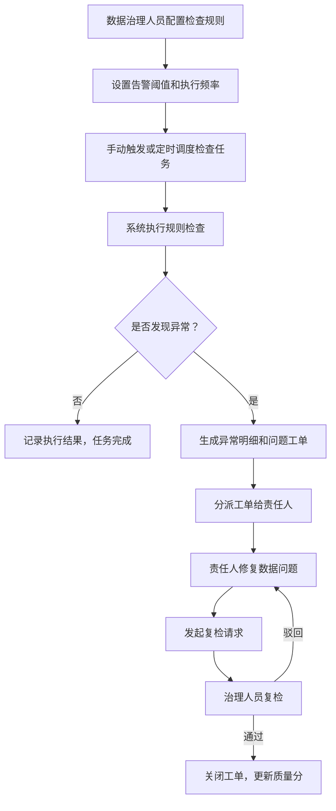
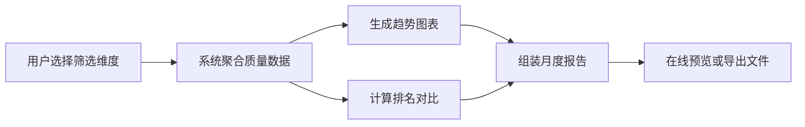

## 1. 产品概述

数据质量中心（Data Quality Center, DQC）是面向数据治理人员和业务负责人的集中式数据质量管理平台，旨在通过自动化规则检查、工单流转和可视化报告，快速发现、跟踪并解决数据质量问题，提升企业数据资产的可信度和业务价值。

- 目标用户：数据治理专员、数据分析师、业务部门负责人、CIO/CDO
- 核心价值：统一质量标准、自动化检查、闭环问题处理、数据驱动决策

## 2. 核心特性

### 2.1 用户角色

| 角色 | 注册方式 | 核心权限 |
|------|----------|----------|
| 数据治理人员 | 企业账号登录 | 规则配置、任务调度、问题分派、报告导出 |
| 业务负责人 | 企业账号登录 | 查看质量分、审批工单、复检关闭、浏览报告 |
| 系统管理员 | 超级管理员授权 | 用户管理、系统配置、全局监控 |

### 2.2 功能模块

1. **首页总览**：全局质量分、主题质量排名、问题趋势、待办提醒、快速入口
2. **规则管理**：规则列表、规则类型（完整性/唯一性/及时性/准确性/一致性）、启停开关、告警阈值配置、规则编辑/删除
3. **检查任务**：任务列表、手动触发、定时调度、任务状态、执行日志、异常明细
4. **问题工单**：工单列表、分派责任人、处理进度、影响范围分析、复检关闭、评论记录
5. **质量报告**：多维度筛选（部门/系统/指标）、趋势图表、月度报告、导出PDF/Excel

### 2.3 页面详情

| 页面名称 | 模块名称 | 功能描述 |
|----------|----------|----------|
| 首页总览 | 全局质量分卡片 | 展示综合质量分、环比变化、等级徽章 |
| 首页总览 | 主题质量分布 | 按业务主题展示质量分排名条形图 |
| 首页总览 | 问题趋势图 | 近30天问题发现/解决趋势折线图 |
| 首页总览 | 待办工作台 | 待分派、待处理、待复检工单数统计 |
| 首页总览 | 快捷操作区 | 新建规则、发起检查、分派工单入口 |
| 规则管理 | 筛选工具栏 | 按类型、状态、主题、系统多条件筛选 |
| 规则管理 | 规则列表 | 展示规则名称、类型、阈值、状态、最近执行时间 |
| 规则管理 | 启停开关 | 一键启用/停用规则，支持批量操作 |
| 规则管理 | 规则配置弹窗 | 配置检查SQL、阈值、告警策略、执行频率 |
| 规则管理 | 规则详情抽屉 | 查看规则定义、历史执行记录、关联工单 |
| 检查任务 | 任务看板 | 卡片式展示任务状态、进度条、耗时 |
| 检查任务 | 手动触发 | 选择规则集和检查范围，立即执行 |
| 检查任务 | 定时配置 | CRON表达式配置周期性检查 |
| 检查任务 | 执行详情 | 查看异常记录明细、影响数据量、抽样预览 |
| 检查任务 | 执行日志 | 完整执行链路日志、错误堆栈 |
| 问题工单 | 工单列表 | 表格展示工单状态、优先级、责任人、SLA倒计时 |
| 问题工单 | 分派处理 | 选择责任人、设置截止日期、添加备注 |
| 问题工单 | 进度追踪 | 处理状态流转（新建→处理中→待复检→已关闭） |
| 问题工单 | 影响分析 | 关联数据表、业务系统、下游报表统计 |
| 问题工单 | 复检关闭 | 校验修复结果，通过/驳回操作 |
| 质量报告 | 筛选面板 | 部门、系统、指标类型、时间范围选择 |
| 质量报告 | 趋势分析 | 质量分变化趋势、问题类型分布饼图 |
| 质量报告 | 排名对比 | 部门/系统质量排名对比柱状图 |
| 质量报告 | 月度报告 | 自动生成本月质量报告，支持在线预览 |
| 质量报告 | 导出功能 | PDF/Excel双格式导出报告 |

## 3. 核心流程

### 3.1 数据质量检查流程

### 3.2 质量报告生成流程

## 4. 用户界面设计

### 4.1 设计风格

- **主色调**：深海蓝 `#0F2C59`（专业可信）+ 青色 `#00B4D8`（科技感）+ 金色 `#F4A100`（警示强调）
- **辅助色**：成功绿 `#10B981`、危险红 `#EF4444`、中性灰 `#64748B`
- **按钮样式**：圆角8px，渐变填充按钮 + 线框按钮，悬停微上浮
- **字体**：标题使用 Inter（600-700字重），正文使用系统无衬线字体（400-500字重）
- **布局风格**：左侧导航栏 + 顶部面包屑 + 卡片式内容区，多层级阴影营造层次
- **图标风格**：线性图标（Lucide），16-20px，配色与模块状态联动
- **整体氛围**：企业级专业感，深色侧边栏对比浅色内容区，数据可视化突出

### 4.2 页面设计概览

| 页面名称 | 模块名称 | UI元素 |
|----------|----------|--------|
| 首页总览 | 全局质量分卡片 | 大号数字展示、环形进度条、渐变背景、环比箭头动效 |
| 首页总览 | 主题质量分布 | 横向条形图、质量色阶、hover高亮、可点击跳转 |
| 首页总览 | 问题趋势图 | 双折线叠加、面积填充、时间轴缩放、数据点提示 |
| 首页总览 | 待办工作台 | 三栏卡片、数字徽章、状态色区分、快速操作按钮 |
| 规则管理 | 规则列表 | 表格+行内开关、类型标签、状态指示点、操作列 |
| 规则管理 | 配置弹窗 | 分步骤表单、代码编辑器区域、实时阈值预览 |
| 检查任务 | 任务看板 | 状态色卡片、进度条、耗时统计、快捷操作 |
| 问题工单 | 工单列表 | SLA进度条、优先级徽章、责任人头像、状态流转标签 |
| 质量报告 | 筛选面板 | 级联选择器、日期范围、快捷预设按钮 |
| 质量报告 | 月度报告 | 分区布局、封面设计、图表嵌入、目录导航 |

### 4.3 响应式设计

- 桌面优先设计（1440px基准），适配1280px-2560px屏幕
- 平板端（≥768px）：左侧导航折叠为图标栏，内容区自适应
- 移动端（<768px）：顶部汉堡菜单导航，卡片单列布局，图表简化

### 4.4 动效与交互

- 页面加载：卡片渐入上浮（staggered 50ms延迟）
- 数据更新：数字滚动动画（count-up）
- 状态切换：平滑过渡（300ms ease），环形进度条动画
- Hover效果：卡片上浮2px + 阴影加深，按钮微光扩散
- 通知提示：右上角Toast滑入，错误状态抖动反馈
