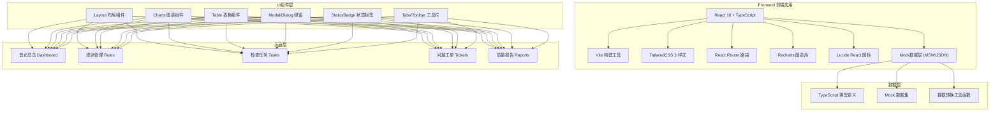
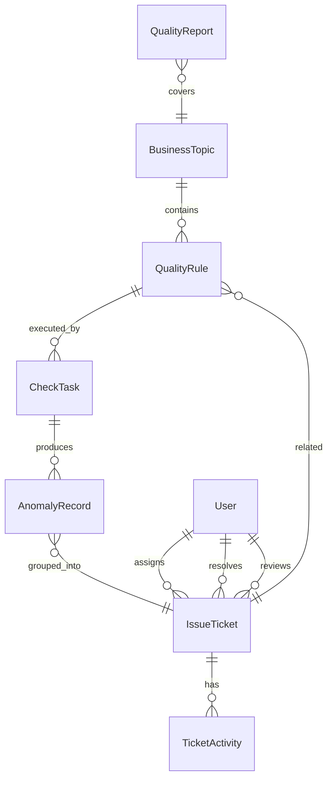

## 1. 架构设计



## 2. 技术说明

- **前端框架**: React 18 + TypeScript 5，函数式组件 + Hooks
- **构建工具**: Vite 5，HMR热更新，生产环境代码分割
- **样式方案**: TailwindCSS 3 + PostCSS，CSS变量主题系统
- **路由管理**: React Router v6，嵌套路由 + 懒加载
- **图表可视化**: Recharts 2.10，支持折线/柱状/饼图/面积图
- **图标库**: Lucide React，线性风格图标，按需导入
- **状态管理**: React Context + useReducer，无需额外状态库
- **数据方案**: 本地Mock数据，TypeScript强类型约束，模拟异步请求
- **日期处理**: date-fns 工具库
- **代码规范**: ESLint + Prettier

## 3. 路由定义

| 路由路径 | 页面组件 | 说明 |
|----------|----------|------|
| `/` | `Dashboard` | 首页总览，质量全局视图 |
| `/rules` | `Rules` | 规则管理列表页 |
| `/rules/:id` | `RuleDetail` | 规则详情抽屉/页 |
| `/tasks` | `Tasks` | 检查任务看板页 |
| `/tasks/:id` | `TaskDetail` | 任务执行详情 |
| `/tickets` | `Tickets` | 问题工单列表页 |
| `/tickets/:id` | `TicketDetail` | 工单处理详情 |
| `/reports` | `Reports` | 质量报告页 |

## 4. Mock 数据类型定义

```typescript
// 质量分等级
type QualityLevel = 'excellent' | 'good' | 'fair' | 'poor' | 'critical';

// 规则类型
type RuleType = 'completeness' | 'uniqueness' | 'timeliness' | 'accuracy' | 'consistency';

// 规则状态
type RuleStatus = 'active' | 'inactive';

// 任务状态
type TaskStatus = 'pending' | 'running' | 'success' | 'failed' | 'partial';

// 工单状态
type TicketStatus = 'new' | 'assigned' | 'processing' | 'reviewing' | 'closed' | 'rejected';

// 优先级
type Priority = 'critical' | 'high' | 'medium' | 'low';

// 用户
interface User {
  id: string;
  name: string;
  email: string;
  avatar?: string;
  department: string;
}

// 业务主题
interface BusinessTopic {
  id: string;
  name: string;
  department: string;
  system: string;
  qualityScore: number;
  level: QualityLevel;
  ruleCount: number;
  issueCount: number;
}

// 检查规则
interface QualityRule {
  id: string;
  name: string;
  type: RuleType;
  topicId: string;
  topicName: string;
  system: string;
  description: string;
  sqlExpression: string;
  threshold: number;
  warningThreshold: number;
  status: RuleStatus;
  scheduleType: 'manual' | 'hourly' | 'daily' | 'weekly' | 'monthly';
  cronExpression?: string;
  lastRunAt?: string;
  lastRunStatus?: TaskStatus;
  passRate?: number;
  createdAt: string;
  createdBy: string;
}

// 检查任务
interface CheckTask {
  id: string;
  name: string;
  ruleIds: string[];
  ruleCount: number;
  triggerType: 'manual' | 'scheduled' | 'api';
  status: TaskStatus;
  progress: number;
  totalRecords: number;
  anomalyRecords: number;
  startTime?: string;
  endTime?: string;
  duration?: number;
  createdBy: string;
  createdAt: string;
}

// 异常记录
interface AnomalyRecord {
  id: string;
  taskId: string;
  ruleId: string;
  ruleName: string;
  tableName: string;
  primaryKey: string;
  fieldName: string;
  expectedValue?: string;
  actualValue?: string;
  anomalyType: RuleType;
  severity: Priority;
  description: string;
  createdAt: string;
}

// 问题工单
interface IssueTicket {
  id: string;
  title: string;
  description: string;
  ruleId?: string;
  ruleName?: string;
  taskId?: string;
  anomalyCount: number;
  affectedTables: string[];
  affectedSystems: string[];
  downstreamReports: string[];
  status: TicketStatus;
  priority: Priority;
  assignee?: User;
  assignor?: User;
  reviewer?: User;
  slaDeadline?: string;
  createdAt: string;
  assignedAt?: string;
  resolvedAt?: string;
  closedAt?: string;
  activityLog: TicketActivity[];
}

// 工单活动记录
interface TicketActivity {
  id: string;
  ticketId: string;
  type: 'create' | 'assign' | 'update' | 'comment' | 'review' | 'close' | 'reject';
  userId: string;
  userName: string;
  content: string;
  createdAt: string;
}

// 质量趋势点
interface QualityTrendPoint {
  date: string;
  score: number;
  issuesFound: number;
  issuesResolved: number;
}

// 质量报告
interface QualityReport {
  id: string;
  month: string;
  department?: string;
  system?: string;
  overallScore: number;
  scoreChange: number;
  totalRules: number;
  totalTasks: number;
  totalIssues: number;
  resolvedIssues: number;
  typeDistribution: { type: RuleType; count: number }[];
  trendData: QualityTrendPoint[];
  topicRanking: BusinessTopic[];
  generatedAt: string;
  generatedBy: string;
}
```

## 5. 数据模型关系



## 6. 组件结构

```
src/
├── components/
│   ├── layout/
│   │   ├── Sidebar.tsx          # 左侧导航
│   │   ├── Topbar.tsx           # 顶部栏
│   │   └── Layout.tsx           # 整体布局
│   ├── charts/
│   │   ├── TrendLineChart.tsx   # 趋势折线图
│   │   ├── HorizontalBar.tsx    # 水平条形图
│   │   ├── DonutChart.tsx       # 环形图
│   │   ├── PieChart.tsx         # 饼图
│   │   └── GaugeChart.tsx       # 仪表盘
│   ├── ui/
│   │   ├── Card.tsx             # 卡片
│   │   ├── Button.tsx           # 按钮
│   │   ├── Badge.tsx            # 标签
│   │   ├── Switch.tsx           # 开关
│   │   ├── Progress.tsx         # 进度条
│   │   ├── Modal.tsx            # 弹窗
│   │   ├── Drawer.tsx           # 抽屉
│   │   ├── Table.tsx            # 表格
│   │   ├── Tabs.tsx             # 标签页
│   │   ├── Avatar.tsx           # 头像
│   │   └── Dropdown.tsx         # 下拉
│   └── shared/
│       ├── StatusBadge.tsx      # 状态标签
│       ├── QualityScore.tsx     # 质量分展示
│       └── SlaTimer.tsx         # SLA倒计时
├── pages/
│   ├── Dashboard.tsx            # 首页总览
│   ├── Rules.tsx                # 规则管理
│   ├── Tasks.tsx                # 检查任务
│   ├── Tickets.tsx              # 问题工单
│   └── Reports.tsx              # 质量报告
├── data/
│   ├── mock/
│   │   ├── topics.ts            # 主题数据
│   │   ├── rules.ts             # 规则数据
│   │   ├── tasks.ts             # 任务数据
│   │   ├── tickets.ts           # 工单数据
│   │   ├── anomalies.ts         # 异常数据
│   │   ├── reports.ts           # 报告数据
│   │   └── users.ts             # 用户数据
│   └── types.ts                 # 类型定义
├── hooks/
│   ├── useModal.ts              # 弹窗Hook
│   ├── useToast.ts              # 通知Hook
│   └── useCountUp.ts            # 数字滚动Hook
├── utils/
│   ├── date.ts                  # 日期工具
│   ├── format.ts                # 格式化工具
│   └── colors.ts                # 颜色工具
├── App.tsx
├── main.tsx
└── index.css
```
